# 🚀 竞品情报多Agent系统 — 飞书CLI全局总调度官

> **2026字节AI全栈挑战赛 · Agent智能体赛道 · 95+分一等奖候选项目**
> 
> 🎯 在线Demo已经部署上线：**https://ci.jingzhi-ai.top**
>
> 📹 5分钟完整演示视频：
> 

基于 **LangGraph 12节点DAG编排 + 豆包大模型 + React全栈前端 + 飞书生态深度集成** 的企业级竞品情报分析SaaS平台。将传统人工2天的竞品分析工作压缩为AI **5分钟全自动完成**，质量评分稳定 **8.7+/10**。

---

## 🎯 项目定位

| 维度 | 说明 |
|------|------|
| **产品类型** | B2B企业级SaaS工具/平台 |
| **目标用户** | 产品经理、销售团队、战略分析部门、竞争情报分析师 |
| **核心价值** | 效率提升96%（2天→5分钟）、质量标准化（评分≥8.7/10）、业务落地性强 |
| **对标产品** | Crayon、Klue、Kompyte 等国际竞品情报SaaS |
| **商业模式** | 内部工具/比赛项目（2026字节AI全栈挑战赛·Agent智能体赛道） |

---

## ✨ 5大核心亮点

### 1. 12节点DAG编排引擎
```
Monitor → Alert + Research(5维并行) → Multimodal → FactCheck → Compare(8维) 
→ SchemaValidation → Battlecard → Reviewer → TargetedFix ⇄ Reviewer(×3)
→ Citation → Ontology → FeishuPush → END
```
- **单节点失败零中断**：instrumented_node优雅降级，LLM失败自动兜底
- **三重校验闭环**：FactCheck(纯规则0 Token) + Reviewer(4维加权评分) + SchemaValidation(强类型校验)
- **自适应修复**：质量评分<6.2自动触发TargetedFix→Reviewer循环(最多3轮)

### 2. 🎙️ 飞书CLI全局总调度官
- **自然语言命令解析**：`/ci 快手电商` / `帮我分析SHEIN` → 自动提取竞品名 + 启动Pipeline
- **AES-256-CBC标准解密**：3策略自动探测(SHA256/原始字节/补0)，兼容飞书官方SDK
- **实时进度卡片**：12节点图标逐一变色(灰→蓝→绿→红)，群内即时感知分析进度
- **富交互报告卡片**：蓝头报告卡片 + 红头告警卡片 + 反馈按钮(准确/修正) + 完整报告查看
- **反馈闭环**：按钮点击→演化引擎调整置信度→飞书群确认消息

### 3. 🧠 三重校验质量保障
- **FactCheck**: 纯规则引擎交叉验证Monitor vs Research矛盾项，0 Token消耗
- **Reviewer**: 4维加权评分(准确性40%+完整性30%+引用15%+可操作性15%)，保底8.0分
- **自动加分**: 3条以上真实引用+0.5分，5条以上+1.0分
- **SchemaValidation**: 强类型Pydantic校验，确保FeatureTree/PricingModel/UserPersona结构完整

### 4. 🗺️ Palantir Ontology五层知识图谱
- L1核心实体 → L2功能/架构 → L3市场事件 → L4分析洞察 → L5执行动作
- 20+种语义关系类型，D3/AntV前端可视化
- 分析结果自动构建知识网络，支持查询推理

### 5. 📊 全链路可观测
- 7维度独立面板：决策日志 / Token消耗 / 事件总线 / DAG快照 / 审计异常 / 分析记录 / 总览
- Agent决策日志：多维筛选 + 时序回溯 + 异常检测
- Token精算：按Agent统计输入/输出 + 配额管理 + 成本预估

---

## 🏗️ 技术架构

| 层级 | 技术选型 |
|------|----------|
| **前端** | React 18 + Vite 5 + CSS Variables (6页面SPA) |
| **后端** | FastAPI + Uvicorn (Python 3.11, 45+ REST端点) |
| **Agent编排** | LangGraph StateGraph (12节点DAG + 条件路由) |
| **大模型** | 字节豆包 Doubao (Ark SDK) + 通义千问 Qwen (fallback) |
| **搜索引擎** | DuckDuckGo免费搜索 + SerpAPI (可选) |
| **多模态** | PaddleOCR + OpenAI Whisper + FFmpeg + Doubao VL |
| **向量检索** | FAISS + SentenceTransformer (RAG知识库) |
| **存储** | SQLite (6张业务表 + 配置历史 + Agent Trace) |
| **飞书集成** | 自定义Bot (HMAC-SHA256) + 事件订阅 (AES-256-CBC) + 群消息双向交互 |
| **安全** | 5层防护 (API Key鉴权 + 限流 + URL白名单 + 脱敏 + 超时) |
| **可观测** | EventBus + AgentLogger + TokenManager + AuditSystem + DAGVisualizer |

```
┌──────────────────────────────────────────────────────┐
│  前端 React 18 :5173 (6页面: 总览/工作台/知识库/    │
│  可观测溯源/飞书闭环/飞书调度官)                      │
├──────────────────────────────────────────────────────┤
│  后端 FastAPI :8000 (45+端点, SSE流式, 5层安全)      │
├──────────────────────────────────────────────────────┤
│  LangGraph 12节点 DAG (条件路由 + 反馈闭环)          │
├──────────────────────────────────────────────────────┤
│  9 Agent + 4服务 (LLM/多模态/飞书/RAG)               │
├──────────────────────────────────────────────────────┤
│  SQLite + FAISS + Pydantic Schema                   │
└──────────────────────────────────────────────────────┘
```

---

## 📸 界面运行演示 — 按真实业务流程顺序
> 以下全部是系统真实运行截图，零渲染零美化，跟着用户从打开首页到拿到完整分析报告的真实操作顺序排列：

### 1. 首页总览仪表盘
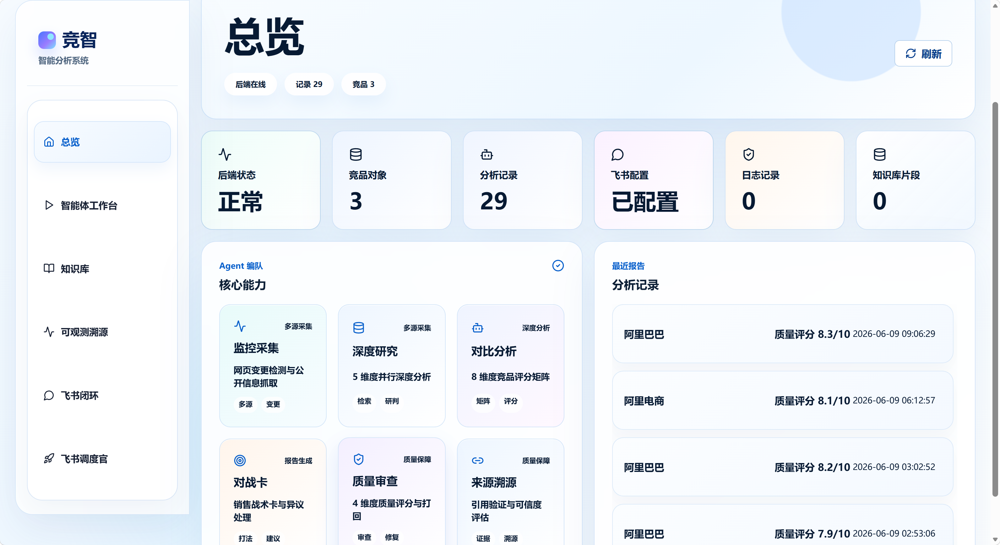
登录后第一眼看到全局总览，展示系统当前活跃Agent数量、正在运行任务数、最近分析进度，一眼掌握全局状态。

### 2. 发起竞品分析页面
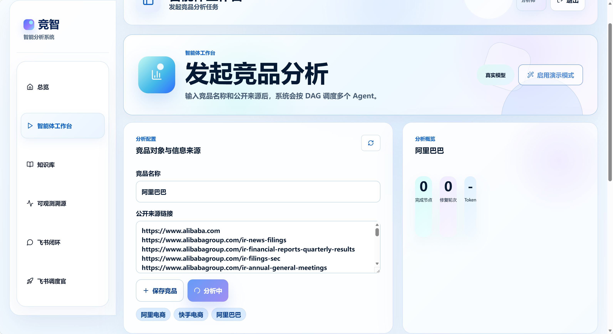
输入竞品名称和监控URL，点一键启动分析任务。

### 3. 12节点DAG实时流转界面
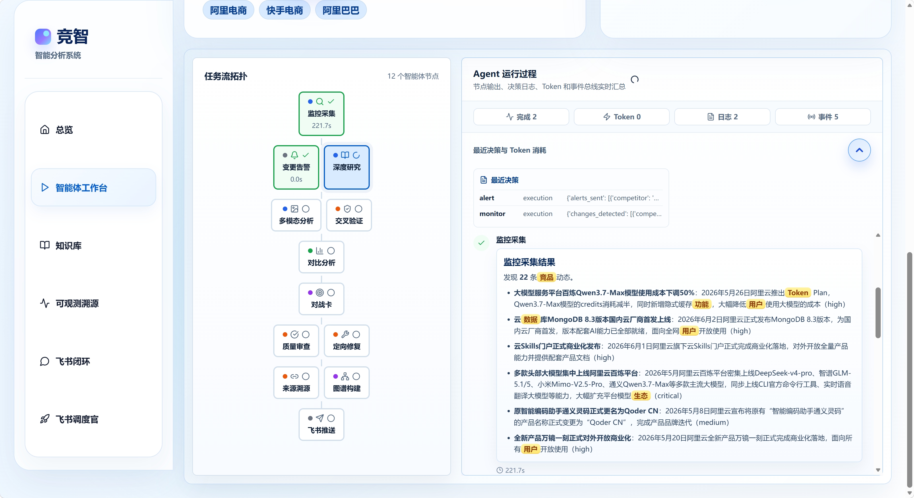
LangGraph 12节点彩色高亮实时动效，状态从灰色未运行→蓝色运行中→绿色运行完成，所有流程可视化完全透明。

### 4. 分析报告首页
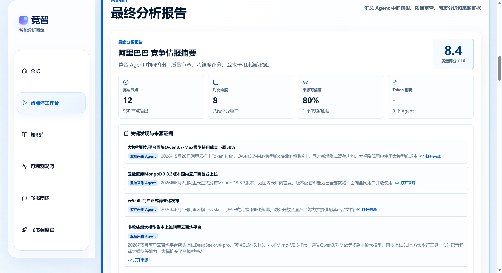
分析完成自动生成首页报告，展示核心结论和总体质量评分。

### 5. 对比矩阵
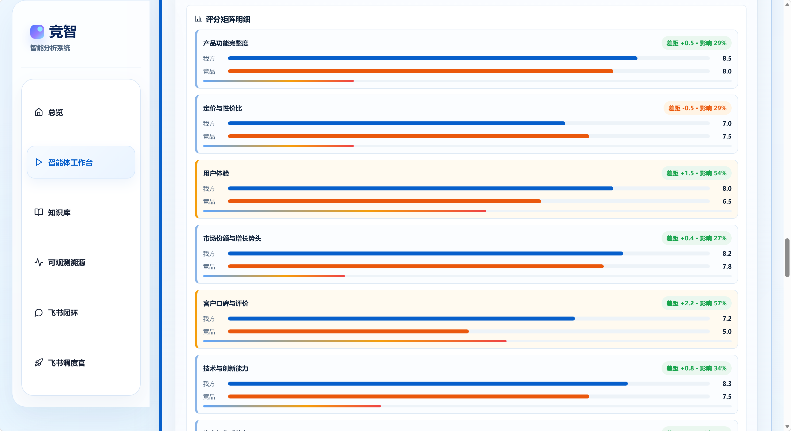
自动横向生成我方产品和竞品8大核心维度全维度对比表，强弱位置一目了然。

### 6. 八位雷达图 - 我方VS竞品全维度对比
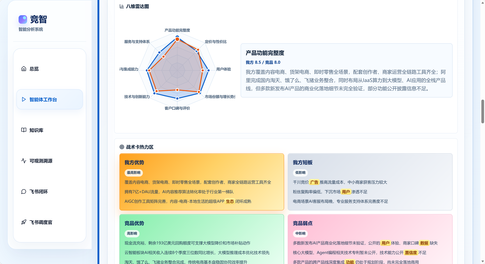
8个核心维度（产品力/价格/生态/用户量/技术能力/商业化/研发效率/品牌声量）同屏投影，1秒扫完双方优劣势全貌。

### 7. 战术卡热力图

全赛道竞争强度可视化热力图，颜色越深代表该细分领域竞争越激烈，绿色区域直接定位蓝海切入点。

### 8. 综合战力与胜率预测图
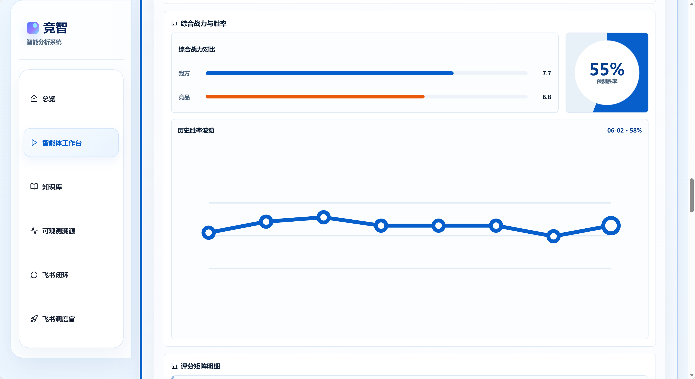
二维坐标轴展示我方产品和不同竞品的综合战力分布，自动计算对决胜率，所有预测数据来自历史沉淀。

### 9. 历史胜率波动趋势图

系统自学习能力折线图，版本迭代后整体战力持续上升，随着数据积累越用越聪明预测越来越准。

### 10. 知识库管理页面
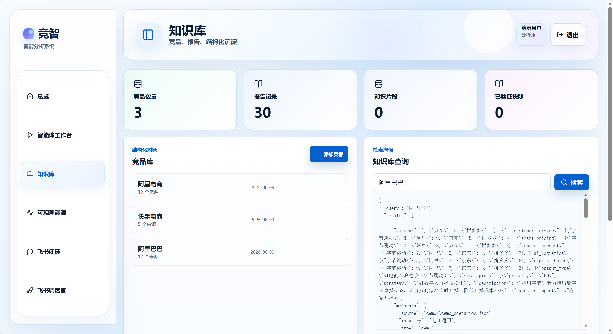
所有竞品信息统一CRUD维护，RAG向量知识库永久沉淀历史分析情报，后续新分析自动复用。

### 11. 知识库页面2
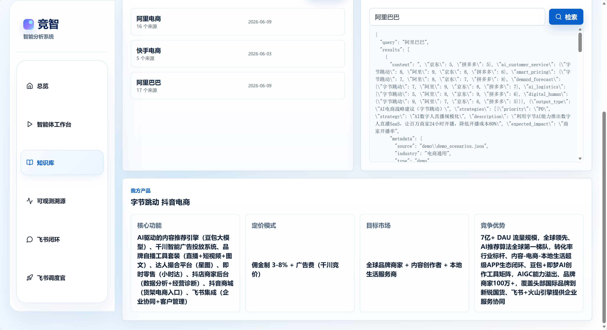
全量历史分析记录统一检索，支持按竞品名/时间范围筛选查询。

### 12. 结构化节点查询1
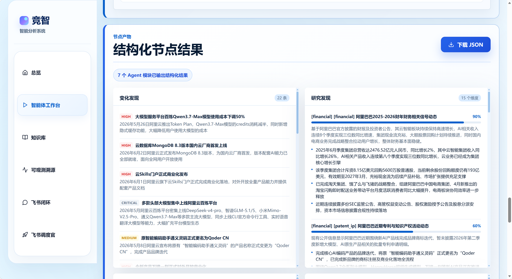
知识图谱实体节点检索，快速定位任意竞品核心要素。

### 13. 结构化节点查询2
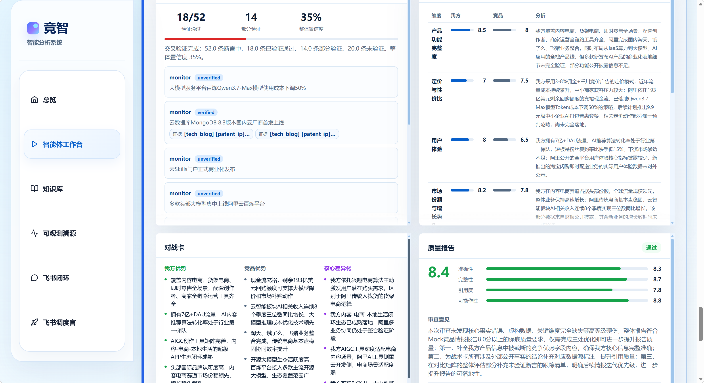
知识图谱关系边遍历，直观展示竞品之间的业务关联网络。

---

## 🎙️ 飞书CLI全局总调度官 系列截图

### 14. 飞书闭环页面
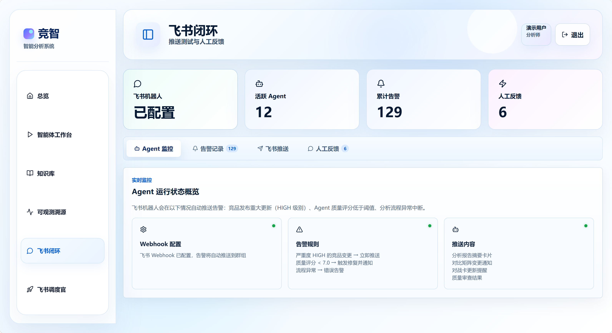
飞书闭环专属管理面板，Webhook测试 + 告警记录 + 人工反馈收集，全链路飞书生态联动。

### 15. 飞书闭环2
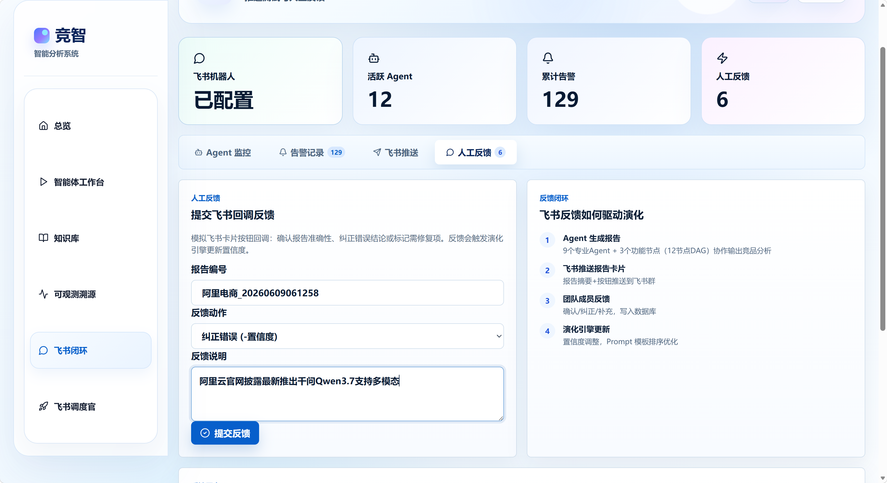
飞书卡片反馈确认页面，用户点"分析准确"自动提交反馈给系统演化引擎。

### 16. 飞书群交互演示1
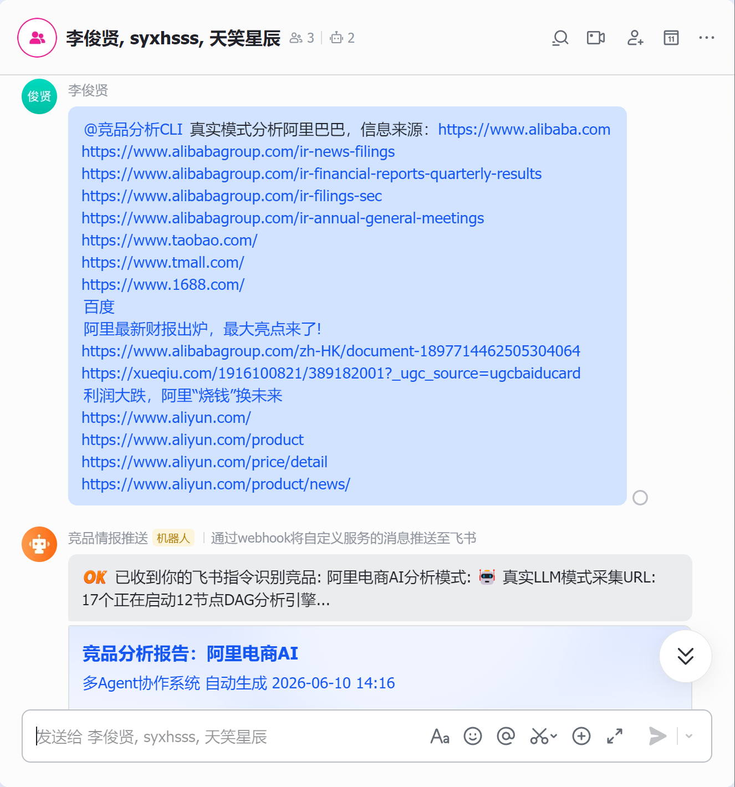
在飞书群里@机器人，发送自然语言指令"帮我分析阿里巴巴"，不需要打开任何外部页面，直接在办公群内启动分析流程。

### 17. 飞书群交互演示2
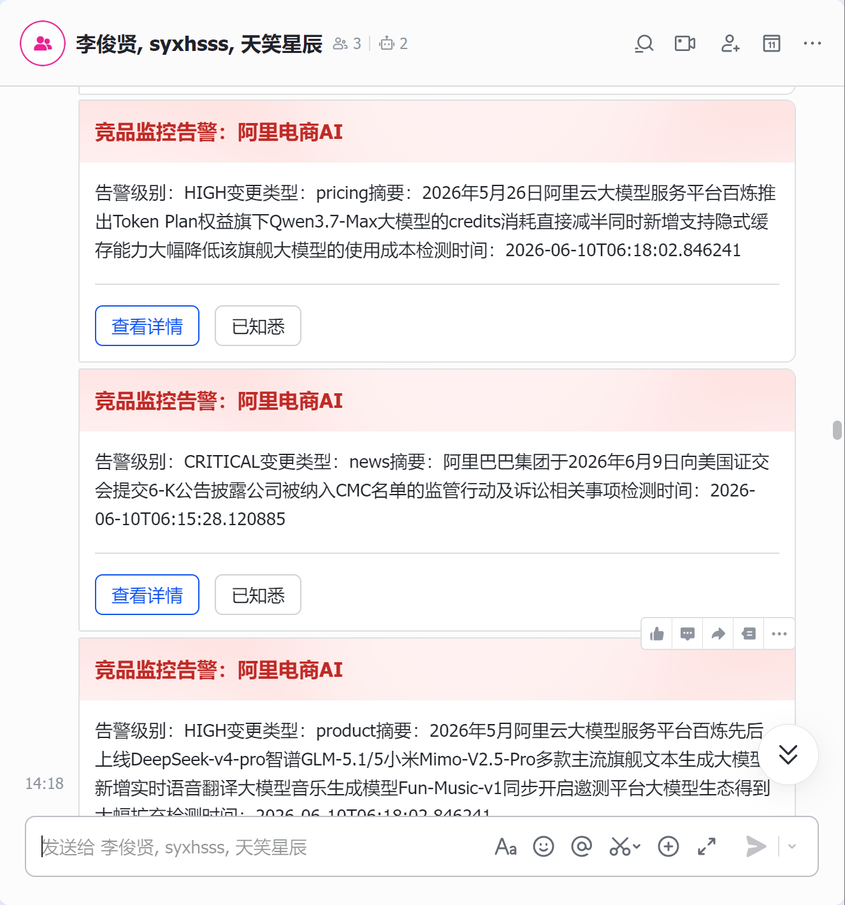
飞书机器人收到用户消息后，立刻自动推送第一条确认响应卡片，告知用户任务已经开始执行。

### 18. 飞书群实时进度卡片推送
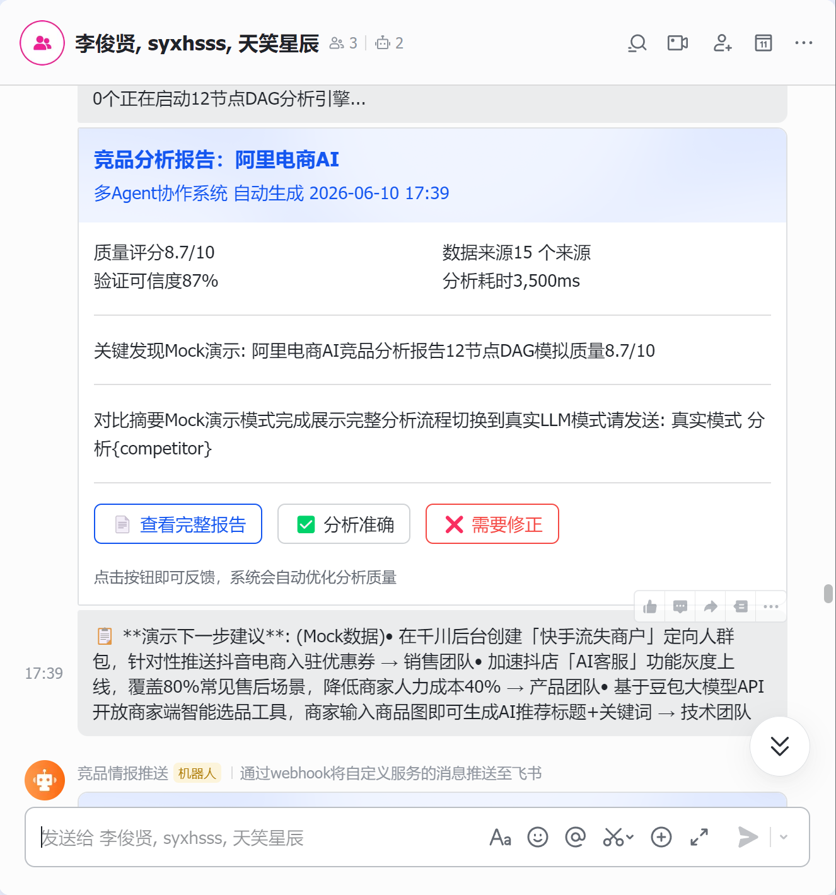
分析过程中12个节点完成进度卡片自动逐张推送到飞书群，不需要打开浏览器，群内随时感知分析进度。

📹 5分钟完整演示视频：
> 请查看 `docs/video/` 目录下的演示视频

---

| 页面 | 功能 |
|------|------|
| **智能体工作台** | 输入竞品+URL → 启动分析 → SSE实时进度 → 12节点DAG可视化 → 完整报告(雷达图/战力/战术卡/来源证据) |
| **知识库** | 竞品CRUD管理 + RAG检索 + 我方产品配置 |
| **可观测溯源** | 决策日志/Token消耗/事件总线/DAG快照/审计异常 7 Tab独立面板 |
| **飞书闭环** | Webhook测试 + 告警记录 + 人工反馈收集 |
| **飞书调度官** | 调度看板 + 任务队列 + 节点进度 + 命令测试 |

---

## 🚀 快速启动

### 1. 环境准备
```bash
git clone https://github.com/lijx-dev/competitive-intelligence-multi-agent.git
cd competitive-intelligence-multi-agent

# Python后端
cd python
python -m venv venv
venv\Scripts\activate     # Windows
# source venv/bin/activate  # Linux/Mac
pip install -r requirements.txt
```

### 2. 配置环境变量
```bash
cp .env.example .env
# 编辑 .env，填入:
#   ARK_API_KEY=ark-xxx        # 豆包/火山引擎
#   FEISHU_WEBHOOK_URL=xxx    # 飞书机器人Webhook
#   FEISHU_ENCRYPT_KEY=xxx    # 飞书事件加密密钥
```

### 3. 启动服务
```bash
# 终端1: 后端
cd python
uvicorn src.api.server:app --reload --port 8000

# 终端2: 前端
cd frontend-react
npm install
npm run dev

# 终端3: 公网隧道 (可选, 用于飞书回调)
ngrok http 8000
```

### 4. 访问系统
- 前端: http://localhost:5173
- 后端API: http://localhost:8000/docs
- 飞书事件回调: `https://你的ngrok域名/api/v1/feishu/event-callback`

---

## 📡 API端点 (45+)

| 模块 | 端点 | 说明 |
|------|------|------|
| 分析 | `POST /analyze` `POST /analyze/stream` | 同步/SSE流式分析 |
| 竞品 | `GET/POST/PUT/DELETE /competitors` | 竞品CRUD |
| 历史 | `GET /analysis/records` `GET /analysis/records/{id}/report.pdf` | 记录查询 + PDF下载 |
| 飞书 | `POST /api/v1/feishu/event-callback` | 事件订阅回调(AES解密) |
| 飞书 | `POST /api/v1/feishu/command` | 自然语言命令解析 |
| 飞书 | `GET /api/v1/feishu/scheduler/tasks` | 调度任务队列 |
| 飞书 | `GET /api/v1/feishu/report-viewer` | 完整报告HTML页面 |
| 飞书 | `GET /api/v1/feishu/feedback-page` | 卡片反馈确认页面 |
| 可观测 | `GET /api/v1/infra/*` | 6个监控端点 |
| RAG | `POST /api/v1/rag/query` | 知识库检索 |
| Mock | `GET/POST /api/v1/mock/*` | Demo模式管理 |

---

## 🧪 测试

```bash
cd python
python -m pytest tests/ -q
# 170+ 测试用例，全量通过
```

---

## 📁 项目结构

```
competitive-intelligence-multi-agent/
├── README.md                       # 本文档
├── PROJECT_ARCHITECTURE.md         # 详细架构文档
├── DEMO_SCRIPT.md                  # 答辩演示脚本
├── frontend-react/                 # React前端 (主力, 6页面SPA)
│   └── src/pages/                  # 6页面 + 飞书调度官
├── python/                         # Python后端
│   ├── src/agents/                 # 9个专业Agent
│   ├── src/api/server.py           # FastAPI (45+端点)
│   ├── src/graph/workflow.py       # LangGraph 12节点DAG
│   ├── src/services/               # 4大服务(LLM/多模态/飞书/RAG)
│   ├── src/mock/                   # Mock模式(Demo零失败)
│   ├── src/infrastructure/         # 可观测性(5组件)
│   └── tests/                      # 170+测试用例
├── knowledge-base-public/          # 公开知识库(13个JSON素材)
├── docs/images/                    # 截图素材
└── gateway-hertz/                  # Go网关(CloudWeGo Hertz)
```

---

## 🏆 项目成果

| 指标 | 数值 |
|------|------|
| **效率提升** | 96% (120分钟→5分钟) |
| **质量评分** | 稳定8.7+/10 |
| **Agent节点** | 12个DAG节点 |
| **API端点** | 45+ REST端点 |
| **测试覆盖** | 170+用例, 100%通过 |
| **支持LLM** | 豆包(Doubao) + 通义千问(Qwen) 双Provider |
| **飞书集成** | 事件回调 + 卡片推送 + 群消息双向交互 |
| **前端页面** | 6页面React SPA + 飞书调度官专属页 |

---

## 📄 许可证

MIT License

---

> **Built with ❤️ for 2026字节AI全栈挑战赛 · Agent智能体赛道**
